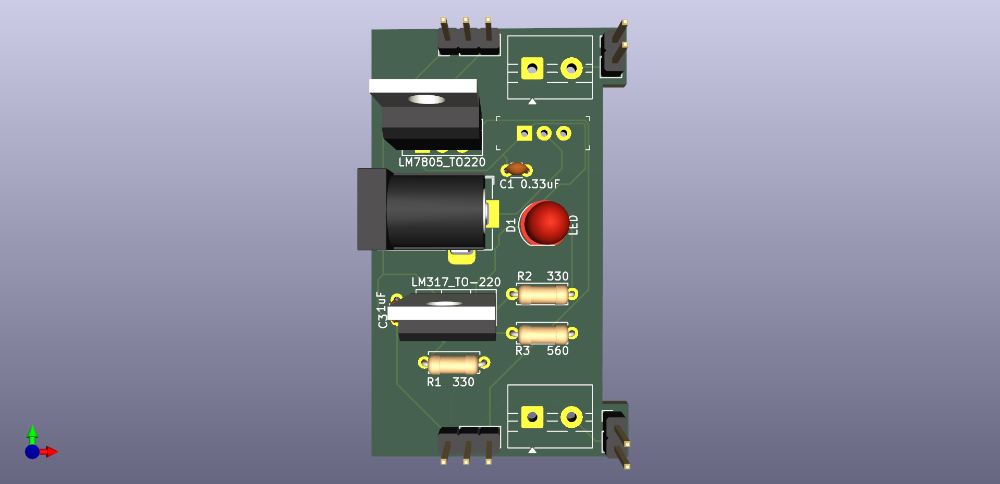

# Breadboard_Power_Supply

**Project Overview:**
Designed and developed a versatile linear power supply module tailored for rapid electronic prototyping and breadboard environments. The system takes a 12V DC input and provides two fully independent, jumper-selectable output channels delivering stable 5V and 3.3V power rails.

**Hardware Architecture & Schematic Design:**
* **Power Input Stage:** Integrated a 12V DC Barrel Jack equipped with a main power switch for safe operation, alongside a dedicated LED power-presence indicator with a calculated current-limiting resistor.
* **Fixed Voltage Stage (5V):** Implemented an LM7805 linear voltage regulator to establish a constant 5V power rail. Included standard decoupling capacitors to filter high-frequency noise and ensure stability.
* **Adjustable Voltage Stage (3.3V):** Configured an LM317 adjustable linear regulator to generate a stable 3.3V rail. Accurately calculated and implemented a resistive voltage divider to set the reference voltage, paired with a 1µF output capacitor for optimal transient response.

**User-Centric Design & Connectivity:**
* **Independent Channel Selection:** Engineered an output architecture featuring two isolated delivery channels. Integrated 3-pin header selectors that allow the user to independently route either the 5V or 3.3V rail to each specific output.
* **Dual-Interface Outputs:** Maximized benchtop versatility by providing two physical connection methods per channel: standard 2.54mm pin headers (optimized for Dupont wires and direct breadboard insertion) and screw terminals for secure, high-current bare-wire connections.

